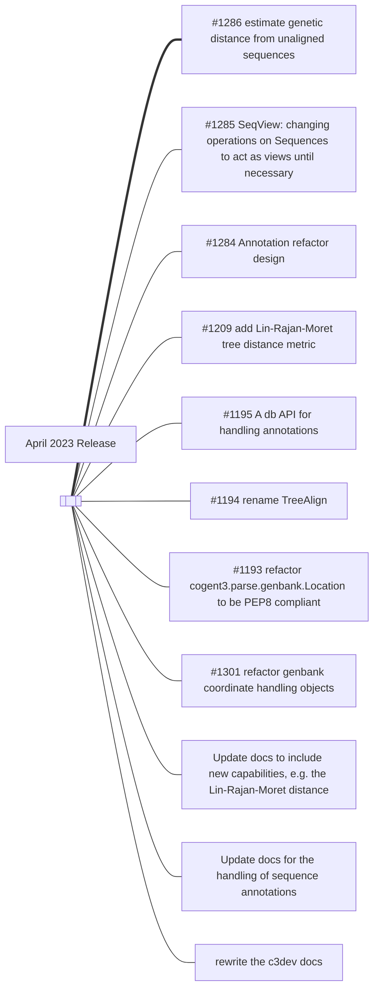
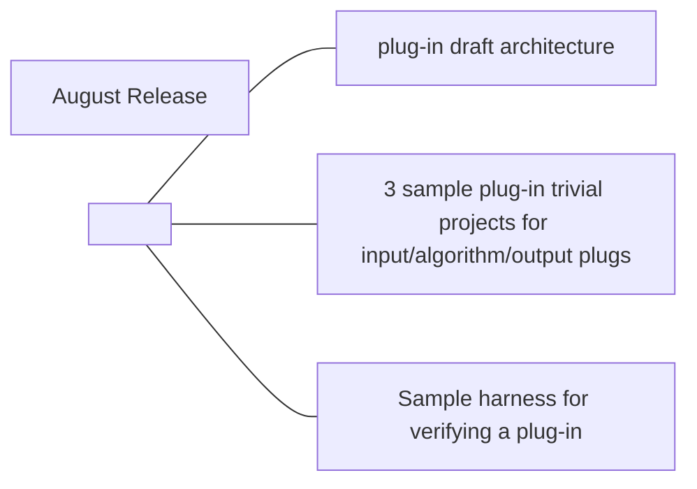
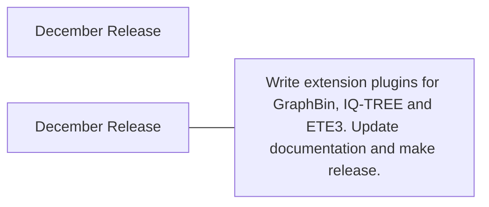
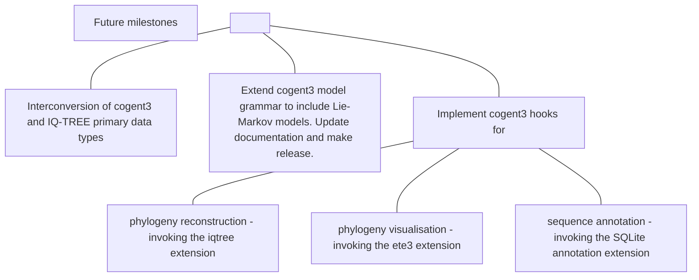
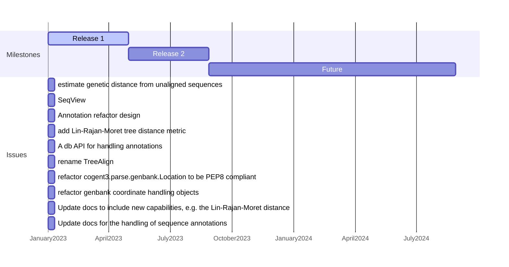
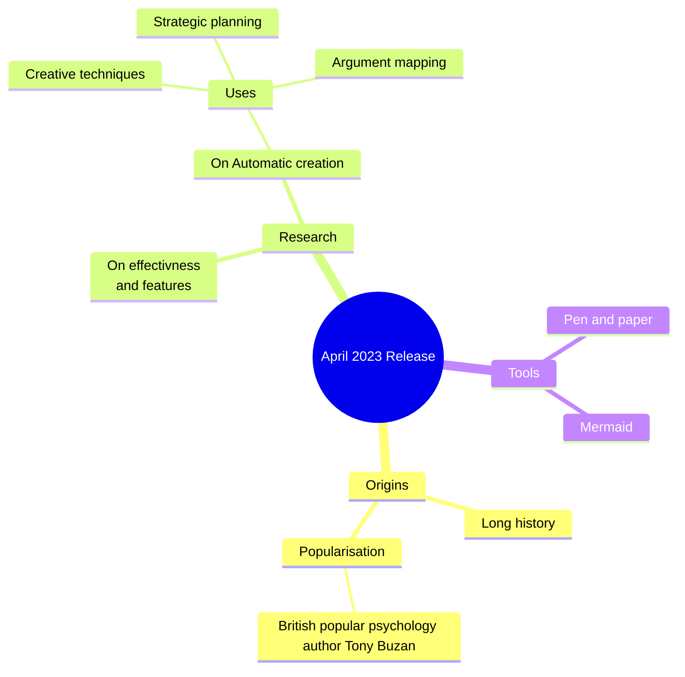

## Milestones

```mermaid
graph LR;
title[April 2023 Release]
    A[[ ]]===I1[#1286 estimate genetic distance from unaligned sequences] 
    A---I2[#1285 SeqView: changing operations on Sequences to act as views until necessary]
    A---I3[#1284 Annotation refactor design]
    A---I4[#1209 add Lin-Rajan-Moret tree distance metric]
    A---I5[#1195 A db API for handling annotations]
    A---I6[#1194 rename TreeAlign]
    A---I7[#1193 refactor cogent3.parse.genbank.Location to be PEP8 compliant]
    A---I8[#1301 refactor genbank coordinate handling objects]
    A---I9[Update docs to include new capabilities, e.g. the Lin-Rajan-Moret distance]
    A---I10[Update docs for the handling of sequence annotations]
    A---I11[rewrite the c3dev docs]
```
---

```mermaid
graph LR;
title[August Release]

    B[ ]---I12[plug-in draft architecture]
    B---I13[3 sample plug-in trivial projects for input/algorithm/output plugs]
    B---I14[Sample harness for verifying a plug-in]
```
---

```mermaid
graph LR;
title[December Release]
    C[December Release]---G[Write extension plugins for GraphBin, IQ-TREE and ETE3. Update documentation and make release.]
```
---

```mermaid
graph TD;
title[Future milestones]
    D[ ]---H1[Interconversion of cogent3 and IQ-TREE primary data types ]
    D---H2[Extend cogent3 model grammar to include Lie-Markov models. Update documentation and make release.]
    D---H3[Implement cogent3 hooks for ]
    H3---H4[phylogeny reconstruction - invoking the iqtree extension]
    H3---H5[phylogeny visualisation - invoking the ete3 extension]
    H3---H6[sequence annotation - invoking the SQLite annotation extension]

```
---

```mermaid
gantt
    dateFormat  YYYY-MM-DD
    axisFormat  %B%Y
    section Milestones
    Release 1 : active, m1, 2023-01-01,2023-04-30
    Release 2 : m2, after m1, 120d
    Future:MF, after m2, 1y
    section Issues
    estimate genetic distance from unaligned sequences : Issue1286, 2023-01-01, 10d 
    SeqView: changing operations on Sequences to act as views until necessary : Issue1285, 2023-01-01, 10d
    Annotation refactor design : Issue1284, 2023-01-01, 10d
    add Lin-Rajan-Moret tree distance metric : Issue1209, 2023-01-01, 10d
    A db API for handling annotations : Issue1195,2023-01-01, 10d
    rename TreeAlign : Issue1194, 2023-01-01, 10d
    refactor cogent3.parse.genbank.Location to be PEP8 compliant : Issue1193, 2023-01-01, 10d
    refactor genbank coordinate handling objects : Issue1301, 2023-01-01, 10d
    Update docs to include new capabilities, e.g. the Lin-Rajan-Moret distance : Extra1, 2023-01-01, 10d
    Update docs for the handling of sequence annotations : Extra2, 2023-01-01, 10d
    

    section Milestone 2

```
---

```mermaid
mindmap
  root((April 2023 Release))
    Origins
      Long history
      Popularisation
        British popular psychology author Tony Buzan
    Research
      On effectivness<br/>and features
      On Automatic creation
        Uses
            Creative techniques
            Strategic planning
            Argument mapping
    Tools
      Pen and paper
      Mermaid
```
