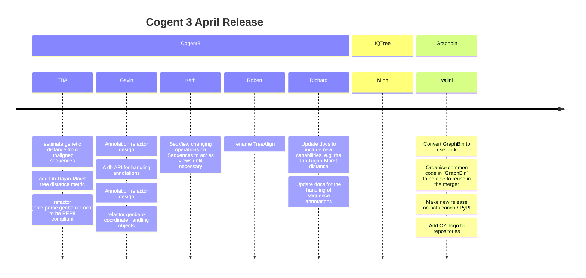
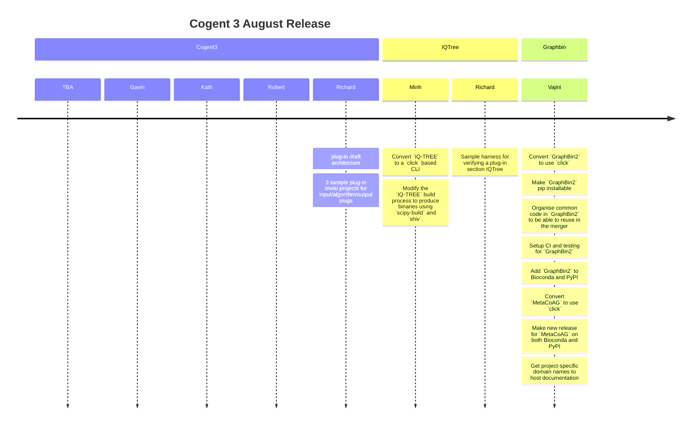
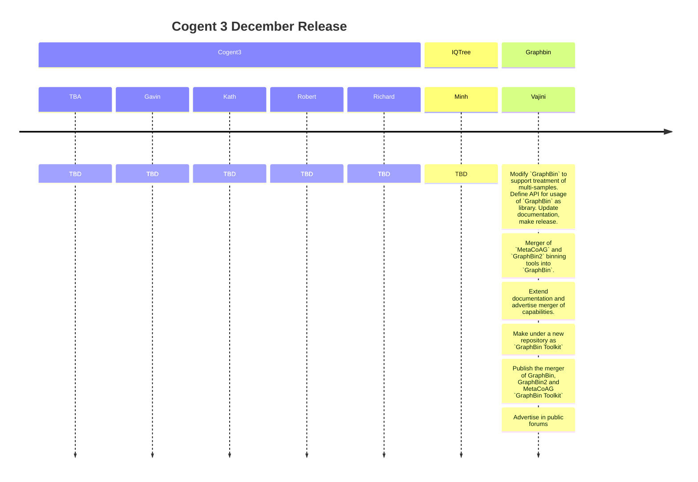
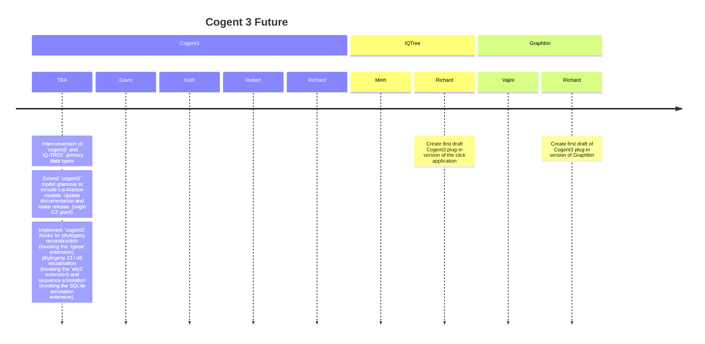

## Milestones

```mermaid
timeline
title Cogent 3 April Release

section Cogent3
TBA : estimate genetic distance from unaligned sequences
: add Lin-Rajan-Moret tree distance metric
: refactor cogent3.parse.genbank.Location to be PEP8 compliant
Gavin : Annotation refactor design : A db API for handling annotations: Annotation refactor design : refactor genbank coordinate handling objects
Kath : SeqView changing operations on Sequences to act as views until necessary
Robert : rename TreeAlign
Richard : Update docs to include new capabilities, e.g. the Lin-Rajan-Moret distance: Update docs for the handling of sequence annotations 


section IQTree
Minh 

section Graphbin 
Vajini 
: Convert GraphBin to use click 
: Organise common code in `GraphBin` to be able to reuse in the merger 
: Make new release on both conda / PyPI 
: Add CZI logo to repositories
```
    

```mermaid
timeline
title Cogent 3 August Release

section Cogent3
TBA 
Gavin 
Kath 
Robert 
Richard 
: plug-in draft architecture 
: 3 sample plug-in trivial projects for input/algorithm/output plugs 

section IQTree
Minh 
: Convert `IQ-TREE` to a `click` based CLI
: Modify the `IQ-TREE` build process to produce binaries using `scipy-build` and `shiv`. 
Richard
: Sample harness for verifying a plug-in section IQTree


section Graphbin 
Vajini 
: Convert `GraphBin2` to use `click`
: Make `GraphBin2` pip installable
: Organise common code in `GraphBin2` to be able to reuse in the merger
: Setup CI and testing for `GraphBin2`
: Add `GraphBin2` to Bioconda and PyPI
: Convert `MetaCoAG` to use `click`
: Make new release for `MetaCoAG` on both Bioconda and PyPI
: Get project-specific domain names to host documentation​

```
---    

```mermaid
timeline
title Cogent 3 December Release
section Cogent3
TBA : TBD
Gavin : TBD
Kath : TBD
Robert : TBD
Richard : TBD

section IQTree
Minh : TBD

section Graphbin 
Vajini : Modify `GraphBin` to support treatment of multi-samples. Define API for usage of `GraphBin` as library. Update documentation, make release.
: Merger of `MetaCoAG` and `GraphBin2` binning tools into `GraphBin`. 
: Extend documentation and advertise merger of capabilities.
: Make under a new repository as `GraphBin Toolkit`
: Publish the merger of GraphBin, GraphBin2 and MetaCoAG `GraphBin Toolkit`
: Advertise in public forums
```
---    

```mermaid
timeline
title Cogent 3 Future

section Cogent3
TBA 
: Interconversion of `cogent3` and `IQ-TREE` primary data types 
: Extend `cogent3` model grammar to include Lie-Markov models. Update documentation and make release. (origin CZ grant)
: Implement `cogent3` hooks for phylogeny reconstruction (invoking the `iqtree` extension), phylogeny 23 / 48 visualisation (invoking the `ete3` extension) and sequence annotation (invoking the SQLite annotation extension).

Gavin 
Kath 
Robert 
Richard 

section IQTree
Minh 
Richard
: Create first draft Cogent3 plug-in version of the click application

section Graphbin 
Vajini 
Richard
: Create first draft of Cogent3 plug-in version of Graphbin
```
---

https://mermaid.js.org/syntax/examples.html