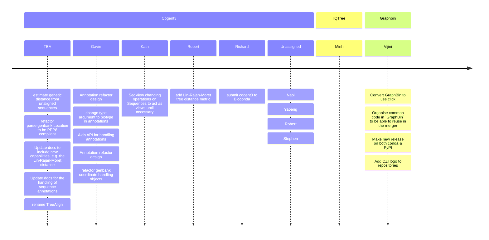
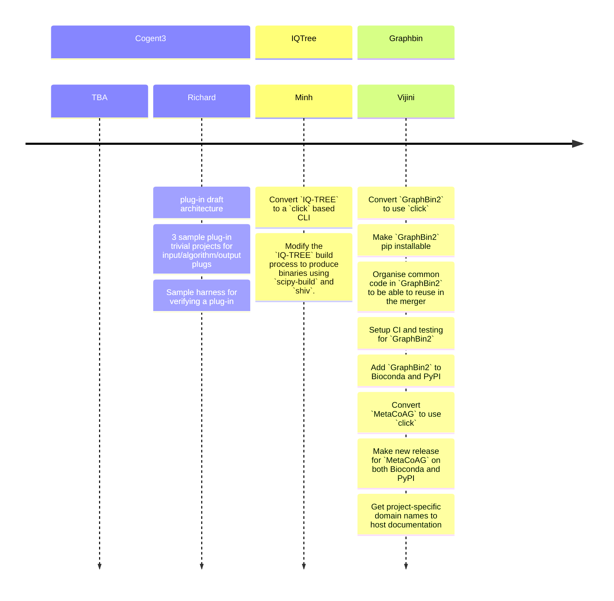
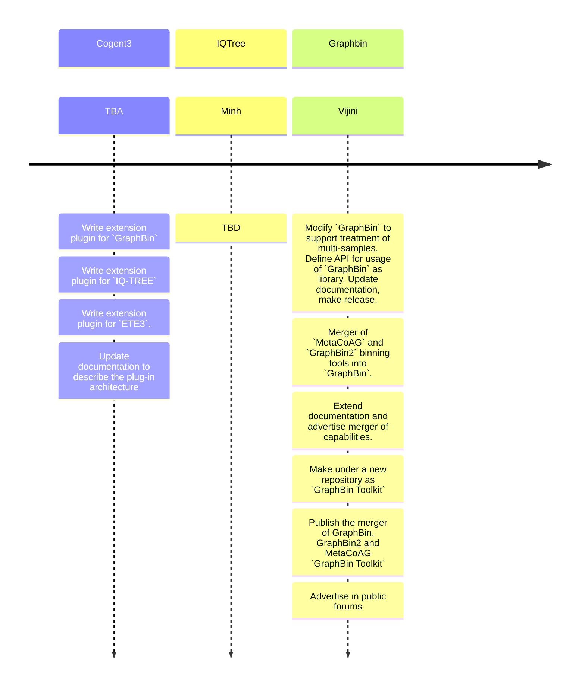
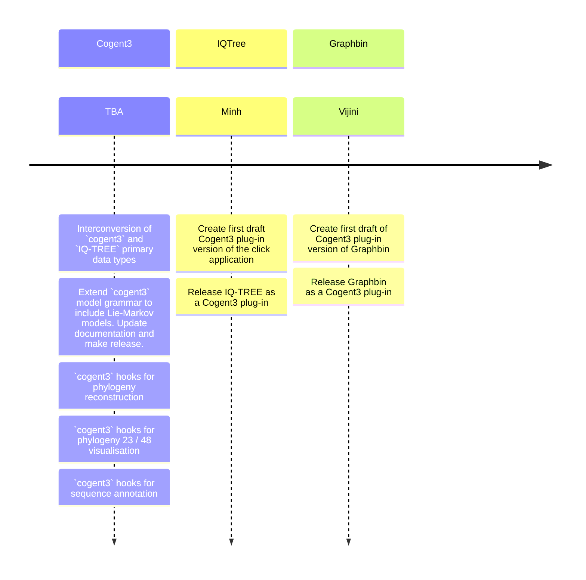

## Milestones
# April Release


```mermaid
timeline

section Cogent3
TBA 
: estimate genetic distance from unaligned sequences
: refactor parse.genbank.Location to be PEP8 compliant
: Update docs to include new capabilities, e.g. the Lin-Rajan-Moret distance
: Update docs for the handling of sequence annotations 
: rename TreeAlign
Gavin 
: Annotation refactor design 
: change type argument to biotype in annotations
: A db API for handling annotations
: Annotation refactor design 
: refactor genbank coordinate handling objects
Kath 
: SeqView changing operations on Sequences to act as views until necessary

Robert 
: add Lin-Rajan-Moret tree distance metric

Richard 
: submit cogent3 to Bioconda

Unassigned 
: Nabi 
: Yapeng 
: Robert 
: Stephen

section IQTree
Minh 

section Graphbin 
Vijini 
: Convert GraphBin to use click 
: Organise common code in `GraphBin` to be able to reuse in the merger 
: Make new release on both conda & PyPI 
: Add CZI logo to repositories
```
---


# August Release
    

```mermaid
timeline
section Cogent3
TBA 
Richard 
: plug-in draft architecture 
: 3 sample plug-in trivial projects for input/algorithm/output plugs 
: Sample harness for verifying a plug-in 

section IQTree
Minh 
: Convert `IQ-TREE` to a `click` based CLI
: Modify the `IQ-TREE` build process to produce binaries using `scipy-build` and `shiv`. 


section Graphbin 
Vijini 
: Convert `GraphBin2` to use `click`
: Make `GraphBin2` pip installable
: Organise common code in `GraphBin2` to be able to reuse in the merger
: Setup CI and testing for `GraphBin2`
: Add `GraphBin2` to Bioconda and PyPI
: Convert `MetaCoAG` to use `click`
: Make new release for `MetaCoAG` on both Bioconda and PyPI
: Get project-specific domain names to host documentation​

```
---    
# December Release

```mermaid
timeline
section Cogent3
TBA  
: Write extension plugin for `GraphBin`
: Write extension plugin for `IQ-TREE` 
: Write extension plugin for `ETE3`. 
: Update documentation to describe the plug-in architecture

section IQTree
Minh : TBD

section Graphbin 
Vijini : Modify `GraphBin` to support treatment of multi-samples. Define API for usage of `GraphBin` as library. Update documentation, make release.
: Merger of `MetaCoAG` and `GraphBin2` binning tools into `GraphBin`. 
: Extend documentation and advertise merger of capabilities.
: Make under a new repository as `GraphBin Toolkit`
: Publish the merger of GraphBin, GraphBin2 and MetaCoAG `GraphBin Toolkit`
: Advertise in public forums
```
---    
# Cogent 3 2024

```mermaid
timeline
section Cogent3
TBA 
: Interconversion of `cogent3` and `IQ-TREE` primary data types 
: Extend `cogent3` model grammar to include Lie-Markov models. Update documentation and make release. 
: `cogent3` hooks for phylogeny reconstruction : `cogent3` hooks for phylogeny 23 / 48 visualisation : `cogent3` hooks for sequence annotation


section IQTree
Minh 
: Create first draft Cogent3 plug-in version of the click application
: Release IQ-TREE as a Cogent3 plug-in

section Graphbin 
Vijini 
: Create first draft of Cogent3 plug-in version of Graphbin
: Release Graphbin as a Cogent3 plug-in
```
```
---